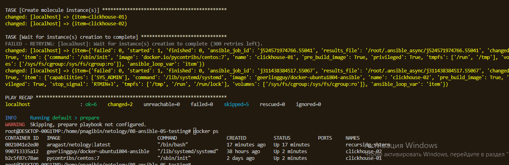
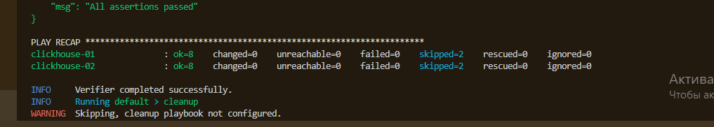
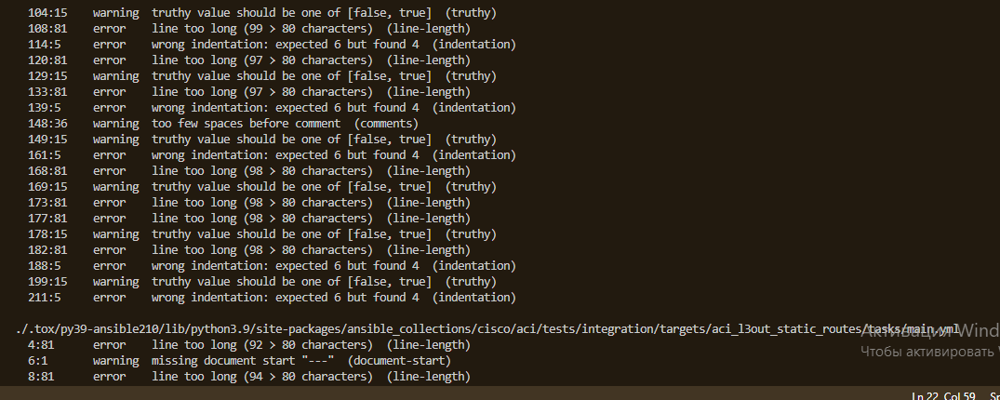
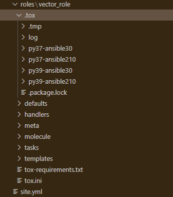

# Home
  
---
## Role Name
  
repo_vector_role  
  
---
## Description
  
Дання роль устанавливает на целевую машину сервис Vector  
  
---
## Dependencies
  
None  
  
---
## Information
  

|Author|Company|License|Minimum Ansible Version|
| :---: | :---: | :---: | :---: |
|Nagibin Pavel|None|license (BSD, MIT)|2.1|

# TASKS


# main.yml


* Vector | Install package

* Vector | Configure vector

* Vector | Configure services


# install_yum.yml


* Install Vector | YUM install


# configure_service.yml


* Configure Service | Template systemd unit


# configure_service.yml


* Configure Service | Template systemd unit

# Template


# vector.service.j2
  
---  
```

[Unit]
Description=Vector Service
After=network.target
Requires=network-online.target
[Service]
User={{ ansible_user_id }}
Group={{ ansible_user_gid }}
ExecStart=/usr/bin/vector --config-yaml {{ vector_config_dir }}/vector.yml --watch-config true
Restart=always
WantedBy=multi-user.target%  
```

# Default


# main.yml
  
---
## vector_version
  
```

0.33.0
...
  
```
## vector_config_dir
  
```

'{{ ansible_user_dir }}/vector_config'
  
```
## vector_config
  
```

null
...
  
```

# Molecule

## Создаю инфраструктуру командй molecule create



## Накатываю роль vetro_role на тестовую инфраструктурой командой molecule converge


## Запускаю тесты роли командой molecule test



# Tox

Запускаю команду docker run --privileged=True -v /home/pnagibin/netology/08-ansible-05-testing/playbook/roles/vector_role:/opt/vector-role -w /opt/vector-role -it aragast/netology:latest /bin/bash

Попадаю в контейнер, запускаю команду tox она выполняется часа полтора, и весь вывод в ошибках



На локальном хосте в директории /home/pnagibin/netology/08-ansible-05-testing/playbook/roles/vector_role создаются виртуальные окружения



Полагаю, что контейнер aragast/netology:latest не рабочий для этой лабы

Общий смысл понятен, ансибл должен был запуститься в виртуальных окружениях Python разной версии и выполнить все теже самые задачи, но на контейнерах podman.

Теоретический материал к этому модулю просто ужасный, автору модуля максимально отдохнул при разработке этого теоретического материала, изучал по статьсям в интернете.

Прошу засчитать модуль.